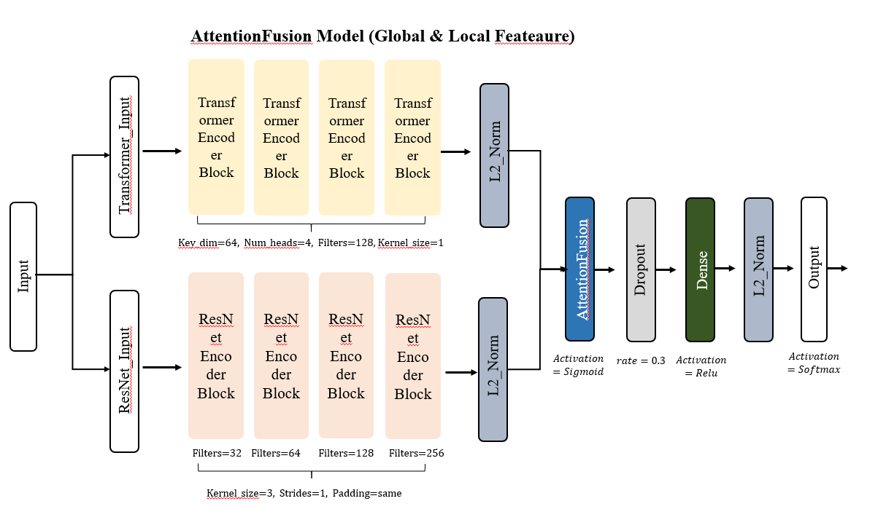
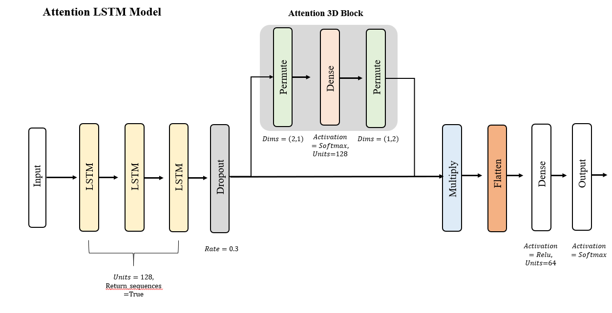
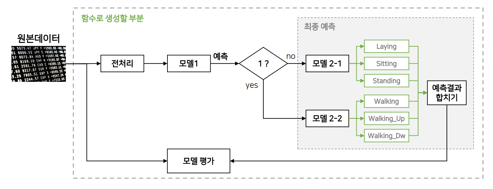

# 🧠 Split-to-Specialize: Dual-Attention HAR Model for Static & Dynamic Activities

## 📌 프로젝트 개요

Human Activity Recognition(HAR) 분야에서 하나의 모델로 모든 활동을 분류하는 방식은 정적(Static)과 동적(Dynamic) 활동의 특성 차이를 반영하기 어렵다는 한계가 있습니다.

이에 본 프로젝트에서는 전체 활동을 <mark>**정적(Static)**</mark>과 <mark>**동적(Dynamic)**</mark>으로 전략적으로 분리하고, 각 그룹에 최적화된 **전용 딥러닝 모델을 학습**하는  
<mark>**2단계 모델링 전략(Two-Stage Modeling Strategy)**</mark>을 제안합니다.

---

## ✨ 핵심 특징

- 🧭 **활동 유형 분리 (Stage 1)**: HAR 데이터 라벨을 기준으로 Static과 Dynamic으로 분리 (규칙 기반)
- 🧠 **전용 모델 설계 (Stage 2)**:
  - Static → Attention Fusion Model (ResNet + Transformer 병렬 구조)
  - Dynamic → PCA + 3-Layer LSTM + Attention3D
- 📈 **최대 F1 Score 98.12% 달성 (UCI HAR 기준)**

---

## 🧪 사용 데이터셋

| Dataset | 설명 |
|--------|------|
| [UCI HAR](https://archive.ics.uci.edu/ml/datasets/human+activity+recognition+using+smartphones) | 스마트폰 IMU 센서 기반 6개 활동 |
| [WISDM](https://www.cis.fordham.edu/wisdm/dataset.php) | 가속도 기반 행동 데이터 |
| [PAMAP2](https://archive.ics.uci.edu/ml/datasets/PAMAP2+Physical+Activity+Monitoring) | 고해상도 센서 기반 12개 활동 |
| mHealth | Google Drive 제공: [📥 다운로드](https://drive.google.com/file/d/1LL6F1uUtkGPbP7WiOs1L4Xic2YadD_cF/view?usp=sharing) |

---

## ⚙️ 방법론: Two-Stage Strategy

### 🔹 Stage 1 - Static vs Dynamic 분리 (Preprocessing)
- Static: `LAYING`, `SITTING`, `STANDING`  
- Dynamic: `WALKING`, `WALKING_UPSTAIRS`, `WALKING_DOWNSTAIRS`  
→ 모델 학습 전 데이터 분할을 통해 성격이 다른 활동을 구분하여 처리

---

### 🔹 Stage 2 - 전용 모델 학습

#### 🧠 Static Classifier: Attention Fusion

- ResNet (Local Pattern) + Transformer (Global Context)
- Orthogonal Attention으로 특징 융합
- 📈 **F1 Score: 96.28**

📊 구조:

<div align="center">
  
</div>

---

#### 🏃 Dynamic Classifier: Attention-LSTM

- PCA 차원 축소 후, 3-Layer LSTM + Attention3D
- 📈 **F1 Score: 98.12**

📊 구조:

<div align="center">
  
</div>

---

## 📊 성능 요약

| Dataset   | Static F1 | Dynamic F1 | Total F1 | Precision | Recall | Accuracy |
|-----------|-----------|------------|----------|-----------|--------|----------|
| UCI-HAR   | 96.27     | **98.12**  | 97.20    | 97.30     | 97.17  | 97.20    |
| PAMAP2    | **99.68** | 99.11      | 99.40    | 99.19     | 99.11  | 99.40    |
| WISDM     | 98.71     | 99.20      | 98.95    | 99.13     | **99.16** | 98.96 |
| mhealth     | 100    | 100      | 100    | 100     | 100 | 100 |

> ✅ Static/Dynamic 전용 모델로 일관된 고성능 유지

---

## 🔬 Ablation Study (ResNet Block 수)

| Dataset | 1B | 2B | 3B | ✅ 4B | 5B |
|---------|----|----|----|------|----|
| UCI     | 93.21 | 93.63 | 95.77 | ✅ 96.28 | 94.49 |
| PAMAP2  | 99.79 | 99.72 | 99.55 | ✅ 99.68 | ✅ 99.68 |
| WISDM   | 97.79 | 97.97 | 97.24 | ✅ 98.71 | 97.42 |
| mHealth | 100.00 | 100.00 | 100.00 | ✅ 100.00 | 100.00 |

> 🧪 Transformer Block 수 및 LSTM Layer 수에 따른 실험도 포함되어 있습니다.

---

## 🔍 혼동 행렬 분석

### Static (UCI-HAR)

| Actual \ Pred | Sitting | Standing | Laying |
|---------------|---------|----------|--------|
| Sitting        | **452** | 39       | 0      |
| Standing       | 19      | **513**  | 0      |
| Laying         | 0       | 0        | **537** |

> 🔎 Sitting과 Standing은 일부 혼동됐지만, 전체 Recall 92~96% 유지

### Dynamic (UCI-HAR)

| Actual \ Pred | Walking | Upstairs | Downstairs |
|---------------|---------|----------|------------|
| Walking       | **494** | 1        | 1          |
| Upstairs      | 24      | **447**  | 0          |
| Downstairs    | 0       | 0        | **420**    |

> 🔎 Dynamic 모델은 대부분 95% 이상 정확하게 인식

---

## 🧩 프로젝트 확장 및 후속 실험 – AIVLE School 1차 미니 프로젝트

<div align="center">
  
</div>

본 프로젝트 이후, UCI HAR Dataset의 **원시 데이터가 아닌 집계 데이터를 활용한 후속 실험**을 진행하였으며, 해당 실험에서는 복잡한 모델보다는 **자동화 및 파이프라인 구조 설계**에 중점을 두었습니다.

- 전처리 → 정적 및 동적 분류 모델 → 세부 행위 분류 모델 → 결과 저장까지의 **엔드투엔드 처리 흐름을 자동화**
- 입력 형태 변화(HAR 원시 데이터 → 집계 데이터)에 따른 **파이프라인 유연성 검증**
- 모델 자체는 단순 구조로 구성했으나, **재사용성과 유지보수성을 고려한 코드 구성 실험**

이를 통해 **실제 서비스나 운영환경에서의 적용 가능성**을 고려한 설계 및 확장 전략을 학습할 수 있었습니다.

> 🔄 해당 프로젝트는 **AIVLE School 1차 미니 프로젝트**로 수행되었으며, 향후 다른 센서 기반 데이터에도 쉽게 확장 가능한 구조로 설계되었습니다.

## 🧩 레포지토리 구성 및 실행 방법

- `250112_UCI(Static)_AttentionFusion(Trans, RESNet)_962.ipynb`: Static 모델
- `250123_UCI_dynamic_PCA_98.ipynb`: Dynamic 모델
- `HAR_CM_250222.xlsx`: 성능 결과 요약
- `images/`: 모델 구조 이미지 폴더
- `mhealth_full.csv`: [🔗 Google Drive에서 다운로드](https://drive.google.com/file/d/1LL6F1uUtkGPbP7WiOs1L4Xic2YadD_cF/view?usp=sharing)

---

### ⚙️ 실행 가이드

```bash
# 환경 구성 (예시)
conda create -n har_env python=3.8
conda activate har_env
pip install -r requirements.txt

# 레포지토리 클론
git clone https://github.com/Uchan99/HumanActivityReconition.git

# Jupyter에서 노트북 실행
jupyter notebook
```
