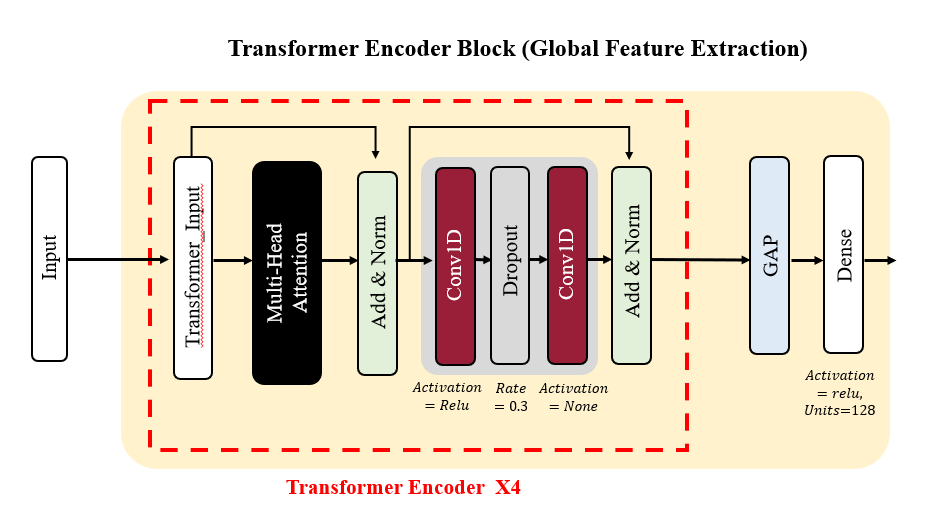

# 🧠 Human Activity Recognition with Specialized Models

## 📌 프로젝트 개요

본 프로젝트는 센서 기반의 인간 행동 인식(HAR) 정확도를 향상시키기 위해, 전체 활동을 **<mark>정적(Static)</mark>**과 **<mark>동적(Dynamic)</mark>**으로 전략적으로 분리하고, 각 활동 특성에 맞는 **전용 모델을 설계**하는 이중 분류 방식(Two-Stage Classification)을 제안합니다.

전통적인 통합 모델 접근에서 벗어나, **활동 유형별 최적화된 구조**를 적용함으로써 **<mark>모델 해석력</mark>**과 **<mark>정밀도</mark>** 모두를 극대화하였습니다.

---

## ✨ 핵심 특징

- **전략적 데이터 분리**: 활동 레이블을 기준으로 Static / Dynamic을 사전 정의하여 분리 학습
- **전용 아키텍처 설계**:
  - 정적: ResNet + Transformer 기반 Attention Fusion 구조
  - 동적: PCA 전처리 + LSTM + Attention 구조
- **<mark>다양한 HAR 데이터셋</mark>에 대한 일반화 실험**: UCI HAR, WISDM, PAMAP2, mHealth 사용

---

## 🧪 활용 데이터셋

| Dataset   | 설명 |
|-----------|------|
| [UCI HAR](https://archive.ics.uci.edu/ml/datasets/human+activity+recognition+using+smartphones) | 스마트폰 IMU 센서 기반 6가지 일상 활동 수록 |
| [WISDM](https://www.cis.fordham.edu/wisdm/dataset.php) | 가속도 기반 행동 인식, 다양한 일상 행동 포함 |
| [PAMAP2](https://archive.ics.uci.edu/ml/datasets/PAMAP2+Physical+Activity+Monitoring) | 고해상도 센서, 12개 활동 포함 |
| mHealth | Google Drive로 직접 제공됨 ([mhealth_full.csv 다운로드](https://drive.google.com/file/d/1LL6F1uUtkGPbP7WiOs1L4Xic2YadD_cF/view?usp=sharing)) |

---

## ⚙️ 방법론: Two-Stage Classification

### ✅ Stage 1: 데이터 분리 (Preprocessing)

- 학습 전에 활동 레이블을 기준으로 **정적 / 동적 활동으로 분리**
- **정적 활동 (Static)**: `LAYING`, `SITTING`, `STANDING`
- **동적 활동 (Dynamic)**: `WALKING`, `WALKING_UPSTAIRS`, `WALKING_DOWNSTAIRS`

---

### ✅ Stage 2: 활동 유형별 전용 분류 모델

#### 🔹 Static Activity Classifier

- **모델 구조**: Attention Fusion = ResNet + Transformer 병렬 구조
- **<mark>F1 Score = 96.28</mark> (UCI-HAR 기준)**
- 📄 관련 파일: `250112_UCI(Static)_AttentionFusion(Trans, RESNet)_962.ipynb`

📊 아키텍처 다이어그램:

<div align="center">
  
  <br><em>Attention Fusion: 전체 구조</em>
</div>

<div align="center">
  
  <br><em>Transformer Encoder (Global Feature Extractor)</em>
</div>

<div align="center">
  
  <br><em>ResNet Encoder (Local Feature Extractor)</em>
</div>

---

#### 🔸 Dynamic Activity Classifier

- **모델 구조**: PCA 차원 축소 + 3-Layer LSTM + Attention3D
- **<mark>F1 Score = 98.12</mark> (UCI-HAR 기준)**
- 📄 관련 파일: `250123_UCI_dynamic_PCA_98.ipynb`

<div align="center">
  
  <br><em>Attention LSTM 기반 동적 활동 인식 구조</em>
</div>

---

## 📊 모델 성능 요약

| Dataset   | <mark>Static F1</mark> | <mark>Dynamic F1</mark> | <mark>Total F1</mark> | <mark>Precision</mark> | <mark>Recall</mark> | <mark>Accuracy</mark> |
|-----------|------------------------|-------------------------|-----------------------|------------------------|---------------------|------------------------|
| UCI-HAR   | 96.27                  | 98.12                   | 97.20                | 97.30                  | 97.17               | 97.20                  |
| PAMAP2    | 99.68                  | 99.11                   | 99.40                | 99.19                  | 99.11               | 99.40                  |
| WISDM     | 98.71                  | 99.20                   | 98.95                | 99.13                  | 99.16               | 98.96                  |

---

## 🔬 Ablation Study (ResNet Block 수에 따른 Static 모델 성능)

| Dataset   | 1-Block | 2-Block | 3-Block | <mark>4-Block</mark> | 5-Block |
|-----------|---------|---------|---------|------------------------|---------|
| UCI-HAR   | 93.21   | 93.63   | 95.77   | <mark>96.28</mark>     | 94.49   |
| PAMAP2    | 99.79   | 99.72   | 99.55   | <mark>99.68</mark>     | <mark>99.68</mark> |
| WISDM     | 97.79   | 97.97   | 97.24   | <mark>98.71</mark>     | 97.42   |
| mHealth   | 100.00  | 100.00  | 100.00  | <mark>100.00</mark>    | 100.00  |

> Transformer Blcok 수에 따른 Static 모델 성능 및 LSTM Blcok 수에 따른 Dynamic 모델 성능도 다음과 같이 계산

---

## 🔍 혼동 행렬 
### UCI-HAR, Static

| 실제\예측 | Sitting | Standing | Laying |
|-----------|---------|----------|--------|
| Sitting   | <mark>452</mark> | 39       | 0      |
| Standing  | 19      | <mark>513</mark>  | 0      |
| Laying    | 0     | 0  | <mark>537</mark> |


> Recall 기준: Sitting = <mark>92.06%</mark>, Standing = <mark>96.43%</mark>, Laying = <mark>100%</mark>

### UCI-HAR, Dynamic

| 실제\예측 | Walking | Walking Upstairs | Walking Downstairs |
|-----------|---------|----------|--------|
| Walking   | <mark>494</mark> | 1       | 1      |
| Walking Upstairs  | 24      | <mark>447</mark>  | 0      |
| Walking Downstairs    | 0     | 0  | <mark>420</mark> |


> Recall 기준: Walking = <mark>99.6%</mark>, Walking Upstairs = <mark>94.9%</mark>, Walking Downstairs = <mark>100%</mark>

---

## 📁 레포지토리 구성 및 실행 방법

- `250112_UCI(Static)_AttentionFusion(Trans, RESNet)_962.ipynb`  
  → 정적 활동 인식 모델 노트북

- `250123_UCI_dynamic_PCA_98.ipynb`  
  → 동적 활동 인식 모델 노트북

- `HAR_CM_250222.xlsx`  
  → 전체 모델 성능 지표 및 혼동 행렬 정리 파일

- `mhealth_full.csv`  
  → Google Drive에서 직접 다운로드 필요 (위 링크 참고)

- `images/` 폴더  
  → 모델 아키텍처 시각화 이미지 저장

---

### 🛠️ 실행 방법

```bash
# 1. GitHub 레포지토리 클론
git clone https://github.com/Uchan99/HumanActivityReconition.git

# 2. Jupyter Notebook에서 아래 파일 실행
- 250112_UCI(Static)_AttentionFusion(Trans, RESNet)_962.ipynb
- 250123_UCI_dynamic_PCA_98.ipynb

# 3. 노트북 상단 셀 따라 라이브러리 설치 및 데이터 경로 지정 후 실행
